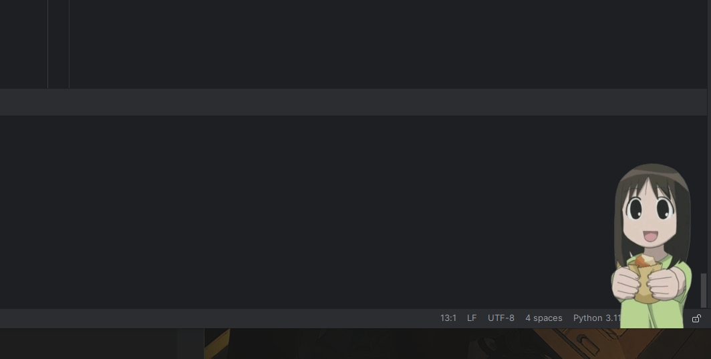

# Sata Andagi

A simple app to bring Osaka from Azumanga Daioh to your screen.

To run the app from source, simply type:

    python SataAndagi.py

Or you can just download the app from these links:

[Download for Windows](https://www.dropbox.com/scl/fi/hyjtz0ljl14xox98w89i3/sata-andagi-windows.zip?rlkey=34qyzq5uzgsahmbh0emkcu46o&st=drfdm2ex&dl=0)  
[Download for Ubuntu](https://www.dropbox.com/scl/fi/im3nvsit9uykh53dfs9g1/sata-andagi-ubuntu.zip?rlkey=1treppztkl1cck6dt1wdnyvg1&st=7r7eum3b&dl=0)

You can drag the image with mouse and put Osaka wherever you want.  
When you click the image, she should say "sata andagi".  
To close the app, you should right-click to the icon near the clock and quit.